*Note: This post is being published early to help you all prepare for Phase 3. It will be updated with additional content as we progress through this section of the course.*

[Last week](/blog/2024/11/05/optimizing-optimizers-llm-adaptation/), we examined systems that optimize themselves in real time. LLM schedulers learning from live traffic. Text-to-text models predicting system behavior. Adaptation happening on timescales of milliseconds to minutes, with continuous feedback enabling rapid adjustment.

This week, we cross a threshold into a fundamentally different domain: **chip design**. Where adaptation cycles aren't milliseconds or minutes, but years. Where there's no patching after deployment. Where a single mistake can cost tens of millions of dollars and years of effort.

**What happens when you only get one chance to get it right?**

This isn't a rhetorical question. In chip design, you make thousands of interdependent decisions about logic, timing, power, and physical layout. You validate everything with simulators and models. Then you commit: you send your design to a fabrication facility, wait months, and hope. If there's a critical bug in the silicon, you don't push a hotfix. You start over.

This changes everything about how reasoning must work.

In Phase 1 (AI for Software), we optimized code with rapid iteration. Compile, test, adjust. In Phase 2 (AI for Architecture), we designed systems with some validation before deployment, but still with opportunities to adapt. In Phase 3 (AI for Chip Design), we enter a domain where **decisions are irrevocable** and **validation is incomplete**.

To understand what AI agents would need to master chip design, we first need to understand what chip design actually is. Many students in this course come from software engineering or systems backgrounds. You've optimized CUDA kernels, architected distributed systems, tuned database queries. But you may have never seen the flow from RTL to silicon.

This post is your primer. We'll build from what you know (compilers, system design) to what you'll need (EDA fundamentals). By the end, you'll understand why chip design poses unique challenges for AI agents, different from everything we've tackled in Phases 1 and 2.

## The Chip Design Chasm

Start with what you know. When you write software:

```python
def fibonacci(n):
    if n <= 1:
        return n
    return fibonacci(n-1) + fibonacci(n-2)
```

Your mental model is clear:
1. Write code (high-level, human-readable)
2. Compile it (automatic translation to machine code)
3. Run it (on existing hardware)
4. If there's a bug, fix it and recompile (seconds to iterate)

This feels natural because the **hardware is a fixed substrate**. You write software that runs on CPUs or GPUs that already exist. The architecture is a given. Your optimization space (from Phase 1) was about making better use of fixed resources.

Now consider chip design. You're designing the hardware itself. Someone has to decide:
- How many transistors to use and how to arrange them
- How fast the clock should run
- How much power it will consume
- How signals propagate through billions of gates
- Whether it will even work when manufactured

**There's still "code" involved**: hardware description languages like Verilog or VHDL. But the gap between "code" and "physical silicon" is vastly larger than the gap between Python and x86 assembly.

The fundamental differences:

**In software:**
- Correctness is mostly logical: does the algorithm do what you intended?
- Performance is about efficient use of resources
- Iteration is cheap: compile and run again
- Debugging is interactive: print statements, debuggers, profilers

**In hardware:**
- Correctness is logical AND physical: does it work AND can you build it?
- Performance is constrained by physics: signal propagation, power delivery, heat dissipation
- Iteration is expensive: months and millions of dollars
- Debugging is limited: you can't "printf" inside a billion transistors

This gap is where **Electronic Design Automation (EDA)** tools live. They bridge human intent and physical reality.

## The Chip Design Flow: A Roadmap

Chip design follows a flow with distinct stages, each with its own tools, challenges, and expertise requirements.


This might look sequential, but it's not. At every stage, you discover problems that send you back to earlier stages (shown by dotted lines). Verification finds RTL bugs. Synthesis reveals that your design won't meet timing. Physical design shows you can't route all the connections. Each iteration is expensive, both in time and human effort.

## Stage 1: RTL Design - Writing Hardware

**RTL (Register Transfer Level)** is how humans describe hardware behavior. It's code, but it's fundamentally different from software code. You're not writing instructions that execute sequentially. You're describing **concurrent hardware that all operates simultaneously**.

As we say in class, here is a simple example: a counter that increments every clock cycle.

```verilog
module counter(
    input wire clk,           // clock signal
    input wire reset,         // reset signal
    output reg [7:0] count    // 8-bit counter output
);
    always @(posedge clk) begin
        if (reset)
            count <= 0;
        else
            count <= count + 1;
    end
endmodule
```

This looks like procedural code, but it's describing **hardware structure**. There's a register (8 bits wide) that holds the count. On every rising edge of the clock (posedge clk), something happens. If reset is high, the register loads 0. Otherwise, the register loads its current value plus 1.

**Key insight:** This code doesn't "run" in the software sense. It specifies behavior that will be implemented as physical gates and flip-flops. Every signal exists simultaneously in space, not sequentially in time.

For students coming from software: imagine if every variable in your program was a physical wire, and every operation was a physical gate. Your program doesn't execute sequentially. Everything happens at once, synchronized by a clock.

### The RTL Abstraction Level

RTL sits at a sweet spot in the abstraction hierarchy. High enough that humans can reason about behavior. Low enough that it can be translated to physical gates. Expressive enough to describe complex systems (CPUs, GPUs, accelerators). Constrained enough that tools can optimize it.

Modern processors contain millions of lines of RTL. The design isn't just "describe the algorithm." It's "describe the parallel hardware structure that implements the algorithm with specific timing, power, and area characteristics."

This is where the first major design decisions happen:
- What's the micro-architecture? (pipeline stages, caches, functional units)
- How are operations scheduled across clock cycles?
- What parallelism do we exploit?
- How do we balance logic depth (gates in sequence) vs. area (total gates)?

These decisions require deep expertise. An experienced chip designer looks at a specification and intuitively knows: "This needs 5 pipeline stages. Put registers here. This path will be the timing bottleneck. This structure will consume too much power."

**This is tacit knowledge** (Week 7's theme). It's accumulated through building many chips and developing intuition about what works.

## Stage 2: Verification - Does It Actually Work?

Before spending months on synthesis and physical design, you need to verify that your RTL actually does what you intended. This is harder than software testing because:

**The state space is enormous.** A modern processor has billions of transistors, representing state spaces of 2^(billions). You literally cannot test all possible states. A 64-bit CPU has more possible states than atoms in the observable universe.

**Bugs in hardware can't be patched.** Software bug in production? Push an update. Hardware bug in silicon? Recall products, respin the chip, lose millions of dollars and months of time. Some famous examples:
- [Intel Pentium FDIV bug](https://en.wikipedia.org/wiki/Pentium_FDIV_bug) (1994): floating-point division error, cost Intel $475 million
- [Intel Spectre/Meltdown](https://en.wikipedia.org/wiki/Spectre_(security_vulnerability)) (2018): security vulnerabilities requiring hardware changes in future generations

Verification uses multiple approaches:

### Simulation

Write test cases (testbenches) that exercise your RTL:

```verilog
// Testbench for counter
module counter_tb;
    reg clk, reset;
    wire [7:0] count;
    
    counter dut(.clk(clk), .reset(reset), .count(count));
    
    // Generate clock
    always #5 clk = ~clk;
    
    initial begin
        clk = 0; reset = 1;
        #10 reset = 0;
        #100 $finish;
    end
endmodule
```

This runs your design through specific scenarios. But which scenarios? You can't test everything. **Coverage** becomes critical: which parts of your design have been exercised? Which corner cases might be lurking?

### Formal Verification

As Andy and Jeff were discussing in class, we can mathematically prove properties about a design: "This bus arbiter never grants access to two requestors simultaneously." "This FIFO never overflows." "This cache coherence protocol maintains memory consistency."

Formal verification is powerful but limited. You can prove specific properties, but you can't prove "the whole chip works correctly." The state space is too large, and you don't know all the properties you should prove.

### The Coverage Problem

How do you know when you've tested enough? In software, you might achieve 90% code coverage. In hardware, code coverage isn't enough. You need **functional coverage** (tested all features?), **corner case coverage** (tested boundary conditions?), **toggle coverage** (every signal changed value?), and **FSM coverage** (tested all state transitions?).

Modern chip companies run billions of test cycles. They use constrained random testing (generate random inputs within valid ranges). They employ dedicated verification engineers whose entire job is thinking of ways the design might fail.

Despite all this, bugs still escape to silicon. **The verification problem is fundamentally incomplete: you're trying to prove absence of bugs, which is much harder than finding bugs that exist.**

## Stage 3: Logic Synthesis - From Behavior to Gates

Once you believe your RTL is correct, you synthesize it: convert behavioral descriptions into actual gates.

**Synthesis** is analogous to compilation, but with crucial differences:

Software compilation: input is high-level code (C, Python), output is assembly instructions, objective is correct translation, optimization is usually for speed (instruction scheduling, register allocation).

Logic synthesis: input is RTL (behavioral hardware description), output is gate-level netlist, objective is correct translation **subject to constraints**, optimization is simultaneously for **area** (number of gates), **timing** (meets clock speed), and **power** (energy consumption).

### The Standard Cell Library

Synthesis doesn't generate arbitrary gates. It uses a **standard cell library** provided by the fabrication facility (TSMC, Samsung, Intel). This library contains pre-designed building blocks: logic gates (AND, OR, NOT, NAND, NOR, XOR in multiple drive strengths), flip-flops (registers that store state), latches (simpler storage elements), and multiplexers, adders, and other complex cells.

Each cell has characteristics: **area** (physical size in square nanometers), **delay** (how long signals take to propagate through it), **power** (static leakage and dynamic switching energy), and **drive strength** (how many downstream gates it can drive).

The synthesizer's job: translate your RTL into a **netlist** (list of cells and their connections) that:
1. Implements the correct behavior
2. Meets timing requirements (signals propagate fast enough)
3. Minimizes area (smaller chip = lower cost)
4. Minimizes power (less heat, longer battery life)

### The Optimization Tradeoffs

These objectives conflict:

**Faster logic often uses more area.** Want to speed up a critical path? Use larger gates (higher drive strength) or add pipeline registers. Both increase area.

**Faster logic often uses more power.** Larger gates have more capacitance. More pipeline registers mean more state to update every cycle. Higher clock speeds mean more switching events per second.

**The same RTL can synthesize to billions of different gate-level implementations.** The synthesizer makes choices at every step: which gate from the library (2-input NAND or 3-input NOR?), which drive strength (1x, 2x, 4x?), how to structure the logic (tree of gates vs. chain of gates?), where to insert pipeline registers?

```mermaid
graph TD
    A[Same RTL Input] --> B{Synthesis<br/>Strategy}
    
    B --> C[Optimize for<br/>SPEED]
    B --> D[Optimize for<br/>AREA]
    B --> E[Optimize for<br/>POWER]
    
    C --> F["⚡ FAST<br/>✗ Large gates<br/>✗ More area<br/>✗ High power"]
    D --> G["📦 SMALL<br/>✓ Minimal gates<br/>✗ Slower<br/>✓ Less power"]
    E --> H["🔋 EFFICIENT<br/>✓ Low power<br/>✗ Slower<br/>≈ Medium area"]
    
    F --> I[Different<br/>Netlists]
    G --> I
    H --> I
    
    style A fill:#e9ecef
    style B fill:#A51C30,color:#fff
    style I fill:#e9ecef
    style F fill:#ffebee
    style G fill:#e8f5e9
    style H fill:#fff3e0
```



This is an **optimization problem** with interdependent constraints - co-design reasoning (Week 8) again. You can't optimize timing without considering area and power. You can't choose gate sizes without knowing the downstream load. Decisions ripple through the entire design.

### How Synthesis Tools Work

Traditional synthesis tools use **heuristics** refined over decades:
1. Translate RTL to a generic gate representation
2. Optimize the logic (remove redundancy, restructure for efficiency)
3. Map to standard cells from the library
4. Optimize for timing (size critical paths)
5. Optimize for area (use smaller gates on non-critical paths)
6. Iterate until constraints are met (or give up and report failure)

These heuristics encode enormous domain expertise. What constitutes a "good" intermediate representation? Which optimizations to apply in which order? When to stop iterating? Experienced chip designers develop intuition about which synthesis strategies work for which design patterns.

**This is another form of tacit knowledge.** The tools have built-in heuristics, but using them effectively requires understanding when to apply which techniques.

## Stage 4: Physical Design - From Gates to Geometry

You now have a netlist: a list of gates and wires connecting them. But gates and wires aren't abstract. They're physical objects that must be arranged in two-dimensional space on a silicon die.

**Physical design** (also called place-and-route) determines four things: **placement** (where each gate physically sits on the chip), **routing** (how wires physically connect the gates), **clock distribution** (how the clock signal reaches all flip-flops), and **power delivery** (how power and ground reach all gates).

This is where physics really matters.

### Placement: Arranging Billions of Gates

Imagine you have a billion gates (not unrealistic for modern chips). You need to arrange them in a rectangular die area. Your objectives: minimize wire length (shorter wires mean faster signals), balance density (don't create hotspots), meet timing (critical paths need short routes), enable routing (leave space for wires), and minimize power (signals traveling through wires consume energy).

**This is a combinatorial optimization problem** that makes the mapping problem from Week 8 look simple. The number of possible placements is approximately (N!)^2 for N gates. For a billion gates, this is incomprehensibly large.

Modern placement tools use sophisticated algorithms: analytical placement (solve optimization equations), simulated annealing (probabilistic search), and partitioning (divide-and-conquer).

But even with advanced algorithms, placement is guided by human expertise. Experienced engineers provide **floorplans** that partition the design into logical blocks (CPU core here, cache there, I/O on the edges). They set **placement constraints** ("these gates must be close together," "this region needs extra power").

### Routing: Connecting the Gates

Once gates are placed, you route wires between them. Sounds straightforward. It's fiendishly complex:

**Multiple metal layers.** Modern chips have 10-15 layers of metal for routing. Lower layers (closer to transistors) have finer pitch but higher resistance. Upper layers have coarser pitch but lower resistance and can carry signals farther.

**Wire congestion.** Some regions have many connections that need to pass through. You might not have enough routing resources. This forces placement changes, which might break timing, which requires synthesis changes. Iterations.

**Wire delay matters.** This isn't a circuit diagram where wires are zero-delay connections. Real wires have **resistance** (slows signal propagation), **capacitance** (requires energy to charge/discharge), and **inductance** (can cause signal integrity issues).

A long wire in upper metal might have 10-100 picoseconds of delay. At multi-GHz clock speeds, this matters. The routing determines wire lengths, which determines delays, which affects whether you meet timing.

**Crosstalk.** Parallel wires couple electromagnetically. A switching signal on one wire can induce noise on adjacent wires. You need spacing or shielding, which consumes routing resources.

### The Timing Closure Challenge

You have constraints like "this chip must run at 3 GHz" (clock period = 333 picoseconds). For every path through the logic (from flip-flop to flip-flop), signals must:
1. Propagate through gates (gate delays)
2. Travel through wires (wire delays)
3. Arrive before the clock edge (setup time)
4. Not arrive too soon after the previous clock edge (hold time)

If any path is too slow (doesn't meet setup time), you have a **timing violation**. The chip won't work reliably at your target frequency.

Fixing timing violations is an art. You can **resize gates** (use faster, larger gates on critical paths), insert **buffers** (break up long wires), **restructure logic** (rearrange gate networks), **change placement** (move gates to shorten critical wires), or **restructure pipelines** (add registers to break up long logic paths, requires RTL changes).

Each fix affects area and power. Each change ripples through the design. You might fix one timing path but break another. This is why chip design has so much iteration.

**Timing closure** is the process of iterating until all paths meet timing. In a complex design, this can take months. It requires deep expertise to know which knobs to turn when.

### Power Delivery and IR Drop

One more critical challenge: distributing power across the chip.

Transistors need power (VDD) and ground (VSS). You might think "just connect everything to power." But power rails are wires, and wires have resistance. When current flows through resistance, voltage drops (**IR drop**).

If parts of your chip experience too much IR drop, they get less voltage than they need. Gates slow down or malfunction.<span class="margin-note">**IR Drop and Software-Assisted Reliability**: Voltage variations from IR drop create reliability challenges that span the hardware-software boundary. My PhD thesis, "Software-assisted Hardware Reliability", explored how software-layer techniques can help mitigate circuit-level challenges like voltage droop, demonstrating that reliability concerns don't have to be solved purely in hardware. By abstracting these challenges to higher execution layers, we can build more robust systems that gracefully handle physical imperfections.</span> You need a **power delivery network**: power grids (mesh of power wires), decoupling capacitors (local charge reservoirs), and multiple power domains (different voltages for different regions).

Designing the power delivery network requires predicting current consumption across the chip during operation. Under-provision, and you get reliability problems. Over-provision, and you waste area on wide power rails.

This is another circular dependency: power delivery depends on placement (where current is consumed), which depends on timing (which gates are used), which depends on synthesis (which gates are selected), which might depend on power constraints.

## Stage 5: Signoff - The Final Validation

Before you can fabricate, you must verify that your physical design will actually work. **Signoff** is the comprehensive validation phase:

### Static Timing Analysis (STA)

Verify that all timing constraints are met. STA tools analyze every path through the design, gate delays (from cell library characterization), wire delays (extracted from layout), clock uncertainty (jitter, skew), and process, voltage, temperature (PVT) variations.

You must verify timing across **corners**: best-case (fast gates, high voltage, low temperature) and worst-case (slow gates, low voltage, high temperature). Gates and wires behave differently under different conditions. Your design must work across all conditions.

### Power Analysis

Verify power consumption: **average power** (does it exceed thermal limits?), **peak power** (can the power delivery network handle it?), and **power domain interactions** (do level shifters work correctly?).

### Physical Verification

Verify that the layout obeys manufacturing rules:

**DRC (Design Rule Check)**: Are all geometric patterns manufacturable? Checks minimum wire width/spacing, metal layer interactions, and via constraints.

**LVS (Layout vs. Schematic)**: Does the physical layout match the logical netlist? Verifies all connections are present and there are no unintended shorts.

**ERC (Electrical Rule Check)**: Are there electrical issues? Checks antenna effects (charge buildup during manufacturing), latch-up conditions, and electromigration concerns.

### The Simulation-Reality Gap

**All of these checks are based on models.** The cell library characterizes gate delays through simulation. The parasitic extraction estimates wire resistance/capacitance from geometry. The timing analysis uses equations to predict signal propagation.

But models are approximations. Real silicon has process variations (transistors aren't identical), environmental effects (voltage noise, temperature gradients), second-order effects (cross-talk, substrate coupling), and manufacturing defects (rare but impactful).

You can't simulate everything. You can't test every corner case. At some point, you make a judgment call: "We believe this design will work." That judgment is informed by decades of modeling improvements, past experience with similar designs, margin in your specifications (designing for better than the minimum requirements), and statistical analysis (what percentage of manufactured chips will work?).

**This is predictive reasoning (Week 9) under extreme uncertainty.** You're making a bet about physical behavior based on incomplete models. Get it wrong, and you discover problems only after spending millions on fabrication.

## Stage 6: Tape Out and Fabrication

When signoff is complete, you **tape out**: send your final design to the fabrication facility.

The design is represented in **GDSII** format: a massive file describing every geometric shape on every layer. A modern chip's GDSII file is gigabytes in size.

The fab (TSMC, Samsung, Intel) takes your design and manufactures it:
1. Start with silicon wafers
2. Use photolithography to pattern each layer (dozens of layers)
3. Deposit materials (metals, insulators)
4. Etch away unwanted material
5. Repeat for every layer
6. Test individual chips on the wafer
7. Cut wafer into individual dies
8. Package working dies

**This takes 3-6 months** and costs millions of dollars (mask sets for advanced nodes cost $5-10 million alone).

Then you wait. When chips come back, you test them. Do they work? Do they meet frequency targets? What's the yield (percentage that work)?

If there's a critical bug, you don't have options. You can't patch hardware. **Metal-layer fixes** (change only the upper routing layers, faster and cheaper than full respin) work only if the problem is minor. Major bugs require redesigning, reverifying, and taping out again.

**This is the irrevocable decision point.** Everything from Phases 1 and 2 had escape hatches. Software has patches. Systems have configuration changes. Hardware has tape out.

## Why This Is Different From Everything in Phases 1 and 2

The differences:

### Iteration Timescales

**Phase 1 (Software):** Edit → compile → test takes seconds to minutes. Deploy → observe → patch takes minutes to hours. Feedback is rapid and cheap.

**Phase 2 (Architecture/Systems):** Design → simulate → validate takes hours to days. Deploy → monitor → adjust takes days to weeks. Feedback is delayed but manageable.

**Phase 3 (Chip Design):** Design → verify → synthesize → place → tape out takes months. Fabricate → test takes additional months. If there's a problem, restart from design (months to years). **Feedback comes after irrevocable commitment.**

### Cost of Errors

**Phase 1:** Low - bugs are embarrassing but fixable

**Phase 2:** Medium - downtime and reconfiguration costs

**Phase 3:** Extreme - $10M-$100M+ per respin, plus time to market delays

### Observability and Debugging

**Phase 1:** High. Print statements, debuggers, profilers. Inspect any variable at any time. Reproduce bugs easily.

**Phase 2:** Medium. Logging, metrics, distributed tracing. Limited observability in production. Reproducing issues requires complex setups.

**Phase 3:** Low. Limited test pins on packaged chips. Can't observe internal signals directly. Debugging requires scan chains, JTAG, or failure analysis (destructive).

### Validation Completeness

**Phase 1:** Can test extensively before deployment. Can canary and gradually roll out. Production is additional validation.

**Phase 2:** Can test at scale in staging environments. Can deploy incrementally. Some issues only emerge in production.

**Phase 3:** Must validate entirely pre-silicon. All validation is model-based. No "try it and see" in production. First real validation is when silicon comes back.

## The EDA Landscape: Tools and Expertise

The EDA industry has evolved over 40+ years to address these challenges. Major players:

**Synopsys, Cadence, Siemens EDA (Mentor):** Provide comprehensive tool suites covering the entire flow

**Specialized tools:** RTL simulation (VCS, ModelSim, Xcelium), logic synthesis (Design Compiler, Genus), physical design (ICC2, Innovus), static timing analysis (PrimeTime, Tempus), and formal verification (JasperGold, VC Formal).

These tools encode decades of expertise: heuristics, algorithms, and optimizations developed through countless tapeouts. They're not simple button-click solutions. Using them effectively requires understanding which synthesis strategy for which design style, how to write timing constraints correctly, how to interpret tool output and debug issues, which knobs to turn when facing problems, and when tool results are trustworthy vs. need manual verification.

More tacit knowledge. Experienced chip designers develop intuition about tool behavior. They know which warnings to worry about ("This one is always benign for this design pattern"). They know how to work around tool limitations. They know which metrics indicate real problems vs. artifacts.

## Where AI Comes In: The Phase 3 Questions

Traditional EDA tools use "AI" in the broad sense: heuristic search, optimization algorithms (simulated annealing, genetic algorithms), and machine learning for specific sub-problems (timing prediction, congestion estimation).

But they rely heavily on human expertise at every stage. The tools automate the mechanics, but humans specify what to build (architecture), guide the tools (constraints, floorplans), debug when things go wrong, make judgment calls about tradeoffs, and decide when design is "good enough".

**The Phase 3 exploration asks:** Can modern AI agents (LLMs, learned models, reinforcement learning) help here?

## Industry Perspective: Why AI for Chip Design Now?

<span class="margin-note"> **Mark Ren** is a researcher at NVIDIA working on AI for EDA. Previously at IBM Research, he worked on physical design, placement, and optimization tools. His research focuses on making EDA tools more scalable and enabling better designer-tool interaction through AI agents.</span>

Our guest speaker, Mark Ren, provided crucial context about why AI for chip design is both urgent and challenging. His perspective from working on EDA at IBM and now NVIDIA reveals why the industry is at an inflection point.

### The Scaling Crisis in EDA

The dominant EDA vendors - Synopsys and Cadence - have been pillars of the chip design industry for decades. Their tools work, and every major chip company depends on them. But they're facing a crisis.

**These tools don't scale.** Modern chips have billions of transistors. EDA tools that worked fine for designs with millions of gates struggle with billions. Runtime explodes. Memory consumption becomes prohibitive. The algorithms that powered EDA for decades hit fundamental limits.

Mark emphasized this isn't just about performance. It's about what's possible to design. When your tools take months to close timing on a design, you can't explore alternatives. You can't iterate. The tools become the bottleneck.

**The architecture problem is worse.** Synopsys and Cadence built their tools in the 1990s and 2000s. These are massive, complex codebases with decades of accumulated features and workarounds. Integrating modern AI isn't straightforward. The tools weren't designed for it. Their internal data structures, APIs, and workflows assume traditional optimization approaches.

This is why Mark's work at NVIDIA focuses on rethinking the foundation. Not just "add AI to existing tools," but "how would you design EDA tools from scratch knowing AI is available?"

### Two Paths for AI in EDA

Mark outlined two complementary research directions:

**Path 1: Improve tool capacity and scalability**

Use AI to make the core algorithms better. The traditional approaches (simulated annealing, analytical placement) have tuned heuristics. Can learning improve them?

This isn't about replacing decades of expertise. It's about augmentation. Use differentiable optimization where analytical models exist. Use reinforcement learning where the search space is too large for hand-crafted heuristics. Leverage GPU acceleration - modern chips have enormous compute capacity that traditional CPU-bound EDA tools don't exploit.

**Path 2: AI agents for designer-tool interaction**

The second path is more ambitious: AI agents that understand design intent and can interact with EDA tools on behalf of designers.

Think about the current workflow. A designer runs synthesis. It fails timing. They examine thousands of lines of tool output. They identify problematic paths. They adjust constraints or modify RTL. They rerun. This takes hours or days per iteration.

An AI agent could: analyze tool output, identify root causes, suggest fixes, apply them, validate results, iterate. Not replacing the designer's judgment, but automating the mechanical parts of the workflow.

This is harder than it sounds. The agent needs understanding of design intent (what's the designer trying to achieve?), understanding of tool behavior (what do these warnings mean?), understanding of design structure (where are the bottlenecks?), ability to propose changes (what might fix this?), and ability to validate (did it actually improve things?).

### The Data Problem

Why isn't this working already? If we have LLMs that can code, why can't they do EDA?

**Lack of training data.** Code generation works because GitHub has billions of lines of open-source code. EDA has no equivalent. Chip designs are proprietary. Companies don't share their netlists, constraints, or tool runs. The data that exists is locked behind NDAs.

Even within a company, the data isn't well-organized. As Mark noted, there's no "universal grammar" for architecture like there is for code. Every design is structured differently. Tool outputs are unstructured text. There's no standardized way to represent design intent, constraints, or optimization objectives.

**Lack of domain knowledge.** Current LLMs don't understand hardware. They might generate syntactically valid Verilog, but does it synthesize well? Does it meet timing? Does it implement the correct functionality?

Training an agent for EDA requires large datasets of designs with annotations, examples of good and bad design decisions, traceability from high-level intent to low-level implementation, and feedback loops showing what worked and what didn't. None of this infrastructure exists at scale.

### Why This Is Different From Code Generation

Students often ask: "If LLMs can write code, why not hardware?"

Mark's answer: **The learning signal is delayed, sparse, and expensive.** An AI agent for code can run tests thousands of times per hour. An AI agent for EDA might get one or two iterations per day (see the Phase comparison table above for detailed timescales).

This changes how you must approach training. You can't just throw reinforcement learning at it. You need models that learn from limited data. You need strong priors about what works. You need ways to validate without full implementation.

### Differentiable Optimization and RL

Mark identified two key research directions:

**Differentiable optimization:** When you can model relationships analytically (like in Week 8's DOSA), you can use gradients to explore the design space efficiently. This works well for problems with smooth objective functions and known constraints.

The challenge is extending this to more of the EDA flow. Can you make placement differentiable? Routing? Clock tree synthesis? Some aspects have clear analytical models. Others are discrete, combinatorial, and resistant to gradient-based methods.

**Reinforcement learning:** For aspects that resist analytical modeling, RL offers a way to learn from experience. The agent explores the design space, receives rewards (better PPA, meeting timing), and learns policies.

The challenge is sample efficiency. You can't afford millions of training episodes when each one requires hours of tool runtime. You need good reward shaping (what constitutes progress?), effective exploration strategies (how to find promising regions?), and transfer learning (how to apply knowledge across designs?).

### The Augmentation Philosophy

A key insight from Mark: **AI should augment existing tools, not replace them.** Throwing away decades of validated EDA infrastructure to build pure AI tools would be reckless.

Instead, identify the bottlenecks: where do tools struggle (scaling, runtime, memory), where do designers spend time (iterating on constraints, debugging), and where is expertise scarce (knowing which knobs to turn)?

Apply AI strategically to these pain points. Use traditional solvers for well-defined problems. Use AI for high-level reasoning, pattern recognition, and navigating large search spaces.

This hybrid approach is more likely to gain industry adoption. It respects existing investments in tools and expertise while introducing AI where it adds clear value.

### The Collaboration Challenge

Mark emphasized the importance of academia-industry collaboration, but acknowledged the challenges. Beyond the data problem described above, there's a temporal mismatch: industry needs solutions now (quarters, not years) while academia explores longer-term research questions. 

**Open-source is limited:** Unlike software, where open-source dominates, chip design has few open-source designs at scale. The OpenROAD project is making progress, but it's still early. RISC-V provides open ISAs but not complete chip implementations.

NVIDIA's approach: Open-source some research tools and methods while keeping proprietary designs internal. Share techniques (differentiable optimization methods, RL frameworks) without sharing the actual design data. This allows the community to build on their work while protecting competitive advantages.

### What Students Should Take Away

Mark's perspective reveals several realities about AI for chip design:

**It's not just an AI problem.** You can't solve EDA with better transformers. You need domain knowledge (what makes a good chip design?), tool understanding (how do existing EDA tools work?), systems thinking (how do decisions interact across the flow?), and engineering pragmatism (what can actually be deployed?).

**Data infrastructure matters as much as algorithms.** Before training better models, you need organized, labeled datasets, standardized representations, traceability from intent to implementation, and feedback loops that capture design quality.

**Hybrid approaches are the near-term path.** Pure AI solutions won't displace traditional EDA soon. The wins come from AI-accelerated solvers (GPU-based implementations), AI-guided search (learning which strategies to apply when), AI-assisted debugging (automated root cause analysis), and AI for designer productivity (reducing manual iteration).

**The long-term question remains open:** Can AI agents eventually master the full EDA flow? Mark's work explores this, but the answer isn't clear. The challenges (sparse feedback, limited data, need for correctness guarantees) are fundamental, not just engineering problems to solve with more compute.

This is why chip design is fascinating for Phase 3. Unlike code generation, where AI has clear wins, or systems optimization, where learning from production data works, chip design forces us to confront: **What does AI need to reason about physical systems with irrevocable decisions and incomplete validation?**

## Questions We'll Explore in Phase 3

Building on the fundamentals and Mark's industry perspective, here are the specific questions we'll examine:

1. **Can AI agents learn to write RTL?** Not just syntactically correct Verilog, but designs that synthesize well, meet timing, and implement correct algorithms. This requires understanding hardware semantics, not just code patterns.

2. **Can AI agents learn synthesis strategies?** The mapping between RTL and gates involves billions of configurations. Can agents learn which work for which designs? (This is Week 8's co-design reasoning in a new domain.)

3. **Can AI agents learn to do physical design?** Placement and routing are optimization problems with massive search spaces. Can learning improve on decades of hand-crafted heuristics?

4. **Can AI agents learn to verify designs?** Finding bugs requires creativity - thinking of corner cases that aren't obvious. Can AI generate better test cases or find bugs through learned patterns?

5. **Can AI agents reason under irrevocability constraints?** When you can't iterate cheaply, you must be right the first time. What does this demand from reasoning systems?

6. **Can AI agents transfer knowledge across process nodes?** What worked at 7nm doesn't necessarily work at 5nm. Physics changes. Can agents adapt learned knowledge, or must they relearn from scratch?

**Connections to Phase 2:** Co-design reasoning (Week 8) applies because synthesis and physical design have circular dependencies between timing, area, and power. Predictive reasoning (Week 9) applies because pre-silicon validation is entirely model-based prediction of physical behavior. Adaptive reasoning (Week 10) doesn't apply the same way; unlike LLM systems, there's no runtime adaptation. You must get it right upfront.

**New challenges for Phase 3:** Irrevocable decisions (no patches, no gradual rollout, no A/B testing). Incomplete validation (can't test everything, must reason about untested cases). Physics constraints (not just algorithmic correctness, but physical realizability). Decade-long knowledge accumulation (EDA tools encode 40+ years of refinement). Sparse training signals (limited data, proprietary designs, delayed feedback).

## What's Coming in Phase 3

The rest of Phase 3 will explore specific areas where AI is being applied to chip design: AI for RTL generation and optimization, AI for logic synthesis and technology mapping, AI for physical design (placement, routing, timing), AI for verification and testing, and the broader question of whether AI agents can become chip designers.

Each topic will examine what makes this problem hard, what traditional approaches do, where AI approaches are being explored, what capabilities AI agents would need, and what forms of tacit knowledge are involved.

By the end, you'll understand not just "Can AI help with chip design?" but "What would it mean for AI agents to truly master the reasoning required for chip design?"

## Building Your Intuition

For those new to hardware:

**Start thinking in space, not time.** Software executes sequentially (even with parallelism, you think of instructions executing). Hardware exists spatially. All your gates are there, all the time, all active simultaneously.

**Think about physical constraints.** Software runs on abstract machines. Hardware is atoms arranged in specific ways. Distance matters. Energy matters. Heat matters.

**Understand the validation challenge.** Software can be tested extensively. Hardware must be right before you build it, based on imperfect models.

**Recognize the iteration cost.** Every design decision must be more carefully considered because you can't easily undo it.

**Appreciate the accumulated expertise.** Decades of engineers have encountered problems and developed solutions. EDA tools encode this knowledge, but using them still requires judgment.

## Reflection Questions

As we enter Phase 3, consider:

**For those with software backgrounds:** What assumptions from software engineering don't transfer to hardware design? Where does your intuition mislead you?

**For those with hardware backgrounds:** What knowledge do you have that's tacit? What do you "just know" that would be hard to teach to an AI agent?

**For everyone:** How does irrevocability change reasoning? When you only get one chance, how does that affect the decisions you make along the way?

**The deeper question:** Can AI agents learn to reason about problems where validation is fundamentally incomplete and decisions are irreversible? What would this require beyond pattern recognition and optimization?

---

*Part 2 will dive deeper into specific AI techniques being applied to EDA, examining concrete research approaches and their effectiveness.*

*For detailed readings, slides, and materials for this week, see [Week 11 in the course schedule]({{ site.baseurl }}/course/schedule/#week-11---eda-fundamentals).*

