# Assignments & Deliverables

## Assignment Overview

This course emphasizes **active engagement** with cutting-edge research through three main components:

- **Weekly Reading Reflections**: Individual critical analysis of research papers
- **Paper Presentations & Discussion Leadership**: Facilitating class discussions and synthesis
- **Group Survey Paper Project**: Collaborative research surveys advancing the field

---

## 1. Weekly Reading Reflections (30%)

**Format**: 1-2 page written reflections on assigned readings  
**Due**: Before each class session  
**Purpose**: Demonstrate critical engagement with material and prepare for discussion

### Structure Guidelines
- **Summary**: What problem does the paper address and what is the key contribution?
- **Analysis**: What are the strengths, limitations, and questionable assumptions?
- **Connections**: How does this relate to other papers and course themes?

---

## 2. Paper Presentations & Discussion Leadership (30%)

**Format**: Present and lead discussion for assigned papers (individually or in pairs)  
**Structure**: 20-minute presentation + 20-minute facilitated discussion per paper  
**Sign-up**: By Week 3

### Presentation Structure
**20-Minute Presentation:**
- Paper summary and key contributions (5-7 minutes)
- Critical analysis: strengths, limitations, methodology issues (8-10 minutes)
- Connections to course themes and other papers (3-5 minutes)

**20-Minute Discussion:**
- Facilitate Q&A and critical discussion
- Prepare 3-4 provocative discussion questions
- Guide synthesis and connections to broader themes

### Responsibilities
- **Preparation**: Meet with instructor 1 week before, prepare slides and discussion questions
- **Flexibility**: Timing may adjust based on guest speaker availability and class dynamics
- **Follow-up**: Brief reflection on presentation effectiveness and discussion insights

---

## 3. Group Survey Paper Project (40%)

**Format**: Collaborative research survey in teams of 2-3 students  
**Scope**: Focused analysis of specific subtopics within course themes  
**Goal**: Produce publication-quality survey papers that advance understanding of AI agents for computer systems design

{: .rationale-box}
### Why This Approach? The Value of Survey Research

**Research Skills Over Implementation**: Rather than coding assignments, this course emphasizes **research synthesis and critical analysis**—the core skills needed to advance the field of AI agents for computer systems design.

**🔍 Field-Shaping Impact**: The field of AI agents for computer systems is rapidly evolving with scattered research across venues (ISCA, MICRO, DAC, MLSys, ICLR, etc.). High-quality survey papers help consolidate knowledge, identify gaps, and guide future research directions.

**📊 Research Methodology**: Students develop crucial skills in systematic literature review, critical analysis, taxonomy development, gap identification, and technical writing for academic publication.

**🎯 Real Research Impact**: These surveys are designed to be **publication-quality** contributions suitable for ML4Sys workshops, computer architecture venues, or survey journals.

### Project Structure & Timeline

**Survey Paper Pipeline**: The project follows a structured pipeline that aligns with course learning phases, allowing students to research topics as they learn them in class.

```mermaid
flowchart TD
    A["Week 1-2: Course Setup<br/>Group Formation"] --> B["AI for Software Groups<br/>(2-3 students each)"]
    A --> C["AI for Architecture Groups<br/>(2-3 students each)"]
    A --> D["AI for Chip Design Groups<br/>(2-3 students each)"]
    
    B --> E["Weeks 2-5: Learn Software Topics<br/>+ Research Literature"]
    C --> F["Weeks 2-5: Learn Software Topics<br/>+ Plan Architecture Research"]
    D --> G["Weeks 2-5: Learn Software Topics<br/>+ Plan EDA Research"]
    
    E --> H["📋 Checkpoint 1: Oct 1<br/>Literature Review<br/>(Software Groups)"]
    
    F --> I["Weeks 6-9: Learn Architecture<br/>+ Research Literature"]
    G --> J["Weeks 6-9: Learn Architecture<br/>+ Plan EDA Research"]
    H --> K["Weeks 6-9: Continue Software<br/>Research & Writing"]
    
    I --> L["📊 Checkpoint 2: Oct 29<br/>Draft Sections<br/>(Architecture Groups)"]
    
    J --> M["Weeks 10-12: Learn EDA<br/>+ Research Literature"]
    K --> N["Weeks 10-12: Finalize Software<br/>Sections"]
    L --> O["Weeks 10-12: Finalize Architecture<br/>Sections"]
    
    M --> P["📖 Checkpoint 3: Nov 19<br/>Final Integration<br/>(EDA Groups)"]
    
    N --> Q["Week 13: Final Assembly<br/>All Groups Integrate"]
    O --> Q
    P --> Q
    
    Q --> R["🎯 Dec 1: Final Presentations<br/>Complete Survey Papers"]
    
    style H fill:#e1f5fe
    style L fill:#f3e5f5
    style P fill:#e8f5e8
    style R fill:#fff3e0
```

### Survey Topics (2-3 students per topic)

**Phase 1: AI for Software**
1. LLM-based Code Generation & Evaluation
2. AI-driven Performance Optimization & Compiler Design  
3. GPU Kernel Optimization & Parallel Programming Automation
4. AI for Distributed Systems & Resource Management

**Phase 2: AI for Architecture**
5. ML-based Performance Prediction & Modeling
6. AI-driven Design Space Exploration for Accelerators
7. Learned Memory Systems & Data Management
8. AI Workload Scheduling & System Co-design

**Phase 3: AI for Chip Design**
9. LLM-assisted RTL Design & Synthesis
10. AI-driven Physical Design & Placement
11. ML for Verification & Testing Automation
12. End-to-end AI Chip Design Workflows

### Three-Checkpoint System

{: .checkpoint-list}
#### 📋 Checkpoint 1: Literature Foundation (October 1)
**Who**: Software-focused groups (Topics 1-4)  
**Deliverable**: Annotated bibliography + survey scope (3-4 pages)  
**Requirements**:
- 15-20 key papers identified and categorized
- Clear problem statement and survey boundaries  
- Preliminary taxonomy for organizing the field
- Gap analysis of current literature

{: .checkpoint-list}
#### 📊 Checkpoint 2: Deep Analysis (October 29)
**Who**: Architecture-focused groups (Topics 5-8)  
**Deliverable**: Draft survey sections + comparative analysis (8-10 pages)  
**Requirements**:
- Detailed technical analysis of 3-4 major approaches
- Comparative evaluation framework
- Key trade-offs and design decisions identified
- Preliminary conclusions about field trajectory

{: .checkpoint-list}
#### 📖 Checkpoint 3: Final Integration (November 19)
**Who**: Chip design-focused groups (Topics 9-12)  
**Deliverable**: Complete survey paper (12-15 pages)  
**Requirements**:
- Comprehensive literature review with novel insights
- Critical evaluation of current state-of-the-art
- Future research directions and open challenges
- Publication-ready quality and formatting

{: .checkpoint-list}
#### 🎯 Final Presentations (December 1)
**Who**: All groups  
**Deliverable**: 15-minute presentation + Q&A  
**Requirements**:
- Clear communication of survey findings
- Novel insights and research contributions
- Future directions and open problems
- Professional presentation quality

### Execution Process

**Group Formation (Week 2):**
- Students rank their top 3 topic preferences
- Instructor assigns groups balancing interests and backgrounds
- Groups of 2-3 students per topic for focused, high-quality work

**Topic Approval Meeting (Week 3):**
- 30-minute meeting with instructor and TAs
- Discuss scope, methodology, and timeline
- Receive approval and refinement suggestions
- Establish individual responsibilities within the group

**Ongoing Support:**
- **Bi-weekly check-ins** with TAs during office hours
- **Peer review sessions** between groups working on related topics
- **Cross-group presentations** to share insights and get feedback
- **Mandatory progress updates** at each checkpoint

### Quality Assurance

**Assessment Criteria:**
- **Checkpoint 1 (20%)**: Literature foundation and scope definition
- **Checkpoint 2 (30%)**: Analysis depth and methodological rigor  
- **Checkpoint 3 (50%)**: Final paper quality and presentation

**Quality Mechanisms:**
- **Faculty feedback sessions** after each checkpoint
- **Peer review process** between checkpoints
- **Cross-pollination meetings** where groups share findings
- **Publication readiness review** before final submission

### Survey Paper Standards
- **Comprehensive Coverage**: Systematic review of recent advances (2020-2025)
- **Critical Analysis**: Strengths, limitations, and gaps in current approaches
- **Original Insights**: Novel taxonomy, benchmarking analysis, or methodological comparison
- **Data & Visuals**: Tables, figures, and charts that synthesize key findings
- **Future Directions**: 3-5 concrete research opportunities identified
- **Publication Quality**: Suitable for submission to ML4Sys workshops or survey journals

---

## Course Policies

### Late Work
- Reading reflections: Reduced credit if late
- Survey paper project: Extensions require advance notice from entire team
- Discussion leadership: Must reschedule in advance

### Collaboration
- **Reading reflections**: Individual work
- **Survey paper project**: Required group work (4-5 students per team)
- **Discussion leadership**: Pairs allowed and encouraged

---

